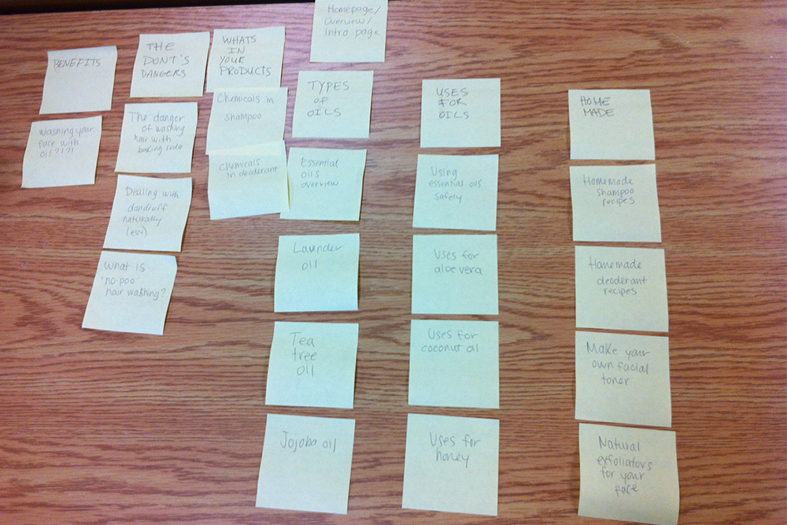
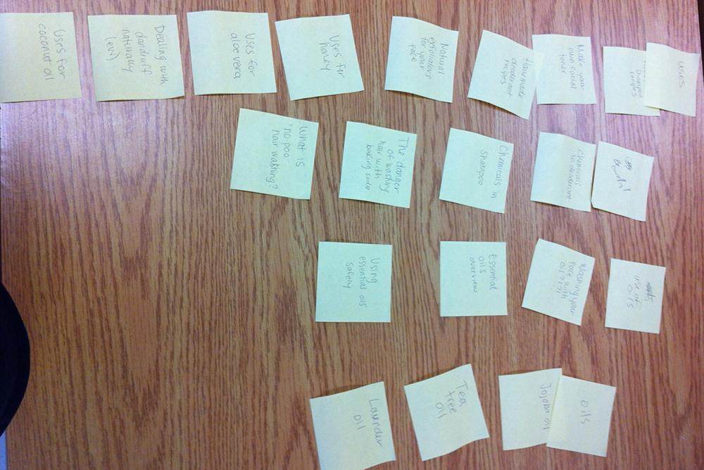

# Card sort report

The purpose of this card sort was to determine common navigation patterns and categories from the content of {your large data-oriented website}.

## Specifics

The card sort was conducted by {your name} on {specific date} between the times of {start time} and {end time} with the following participants:

- Jane Doe
- John Doe

### Cards

{number} cards were used covering a broad range of applicable content for the website. The following topics were used as cards:

1. Card Title 1
2. Card Title 2
3. Card Title 3
4. Card Title 4
5. etc.

## Card sort results

*Card sort 1 by Jane Doe*

*Card sort 2 by John Doe*

## Observations

- Did the participants have any common comments?
- Did they have questions that stood out?
- Did they struggle with certain articles or topics?
- Did they find common groupings? Or were the groupings completely different?
- Were some of the groupings completely unexpected?
- Were the results similar to your expectations?
- How did you feel while watching them perform the task?