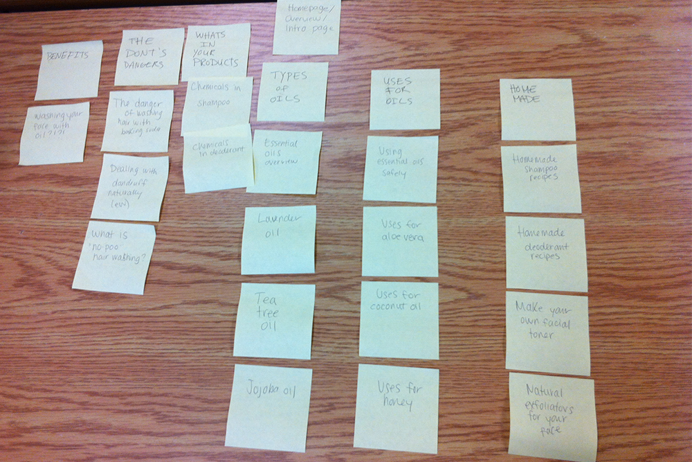

# Card sort report

The purpose of this card sort was to determine common navigation patterns and categories from the content of Natural Skincare.

## Specifics

The card sort was conducted by Sylvia McCauley on September 12th between the times of 4:30PM and 6PM with the following participants:

- Celta Riden
- Sheena Ravary

### Cards

Nineteen cards were used covering a broad range of applicable content for the website. The following topics were used as cards:

1. Washing your face with oil
2. Danger of washing hair with baking soda
3. Dealing with dandruff naturally
4. What is "no-poo hair washing"
5. Chemicals in shampoo
6. Chemicals in deoderant
7. Homepage/overview/intro page
8. Essential oils overview
9. Natural exfoliators for your face
10. Lavender oil
11. Tea tree oil
12. Jojoba oil
13. Make your own facial toner
14. Using essential oils safely
15. Uses for aloe vera
16. Uses for coconut oil
17. Uses for honey
18. Homemade shampoo recipes
19. Homemade deoderant recipes

## Card sort results

*Card sort 1 by Celta Riden*

*Card sort 2 by Sheena Ravary*

## Observations

- Did the participants have any common comments?
	- Both participants found it difficult to sort my cards and took awhile.
- Did they have questions that stood out?
	- No, neither paricipant had any questions. 
- Did they struggle with certain articles or topics?
	- They struggled with certain topics because they had no context for different categories. They found it difficult to sort items or concepts they hadn't heard of.
- Did they find common groupings? Or were the groupings completely different?
	- They both had a "dangers" category, and sorted similar cards into there. They both created a homemade category and similar cards were sorted into there. 
- Were some of the groupings completely unexpected?
	- I did not expect the "no shampoo" category to fall into a dangers category, because it is one of the positive categories. This reminds me that without context a user doesn't know how to organize the information, I suppose. I also didn't expect "dealing with dandruff naturally" to be sorted into the dangers category.
- Were the results similar to your expectations?
	- I didn't really have any expectations, but the results were completely different than how I originally planned on sorting my information. 
- How did you feel while watching them perform the task?
	- Frustrated and intruiged. Frustrated because I already thought I had figured out the best way to sort the information, but intruiged that they had thought of completely different way. 
- Were some of the groupings completely unexpected?
	- I did not expect the "no shampoo" category to fall into a dangers category, because it is one of the positive categories. This reminds me that without context a user doesn't know how to organize the information, I suppose. I also didn't expect "dealing with dandruff naturally" to be sorted into the dangers category.
- The verdict
	- This excercise really made me realize that if my information can't be sorted by the users, they would have a difficult time understanding it on a website. This excercise convinced me to re-think the content that I was using, and I've sinced simplified it. I've combined my previous sorting method with the ones my participants created to make a system that makes much more sense for the user. 